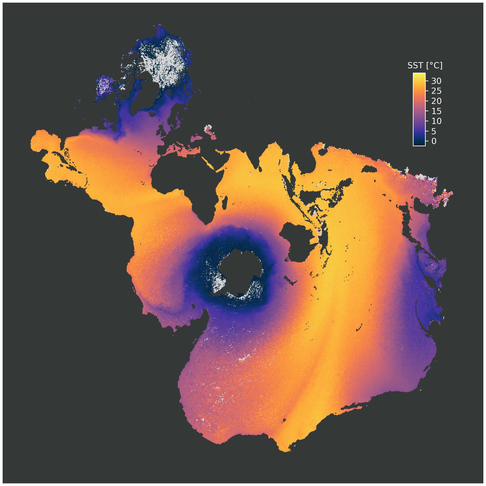

# Spilhaus map projection in Python

TEXT tba
 

> [!IMPORTANT]  
> Because [rtlemos/spilhaus](https://github.com/rtlemos/spilhaus), the repository this project is based on, has the GPL3.0 license, this code has to have necessarily the same license.
> If you do not want to also use this license, distribute just the ouput, not the code itself.
> For more information on how to work with the GPL3.0 license, see [this discussion](https://gist.github.com/kn9ts/cbe95340d29fc1aaeaa5dd5c059d2e60) or the [GPL FAQs](https://www.gnu.org/licenses/gpl-faq.html).

## Data
- [WORLD OCEAN ATLAS 2023 Product Documentation](https://www.ncei.noaa.gov/data/oceans/woa/WOA23/DOCUMENTATION/WOA23_Product_Documentation.pdf)
- https://www.ncei.noaa.gov/products/world-ocean-atlas or https://www.ncei.noaa.gov/thredds-ocean/catalog/woa23/DATA/catalog.html 
- 

## Changes from [rtlemos/spilhaus](https://github.com/rtlemos/spilhaus)
- land mask added to differentiate between ocean data, no ocean data and land.
  - (in the original, coloring land the same as the coldest surface temperatures hides large gaps in the World Ocean Atlas Data. This derivation includes a landmask to differentiate between data, no data and no data applicable.) https://github.com/allochthonous/spilhaus
- data source is updated to the 2023 version of the World Ocean Atlas
- Change to vector graphics with rasterized elements
- more documentation, at least where I understood the code
